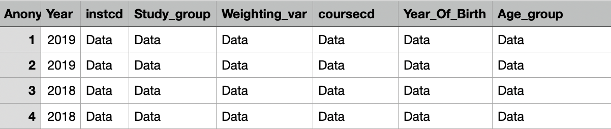

# Student Survey IE Report
Summary report for StudentSurveyIE 

<b>Raw data:</b>
&nbsp;

To prepare the dataset, copy the Raw data from at least two reports into an excel file. Add a column <b>"Year"</b> to denote the year of the survey. The order of the variables does not matter. 

&nbsp;

&nbsp;

Open <b>Student_Survey_IE_Report.Rmd</b> in RStudio. Change the path to lead to your dataset.
Click Knit as seen in the image bellow.

